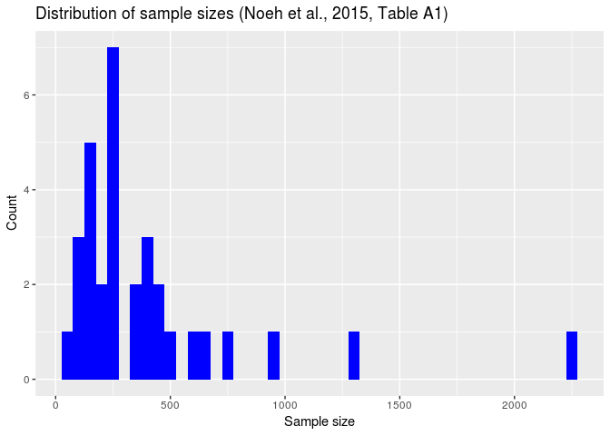
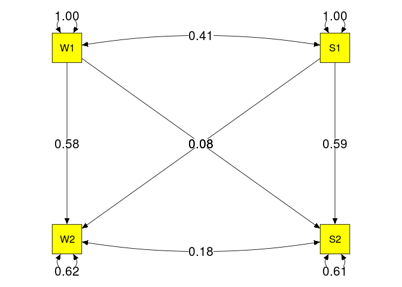
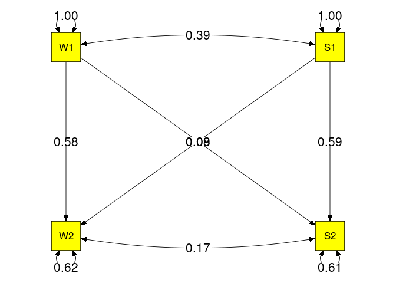

# Illustrations Nohe et al. (2015, Table A1)
Mike Cheung and Suzanne Jak  
`r format(Sys.Date(), "%B %d, %Y")`  

# Summary statistics

```r
## Libraries used in the analyses
library(lavaan)
library(metaSEM)
library(ggplot2)

options(digits=4)

## Display the numbers of studies aggregated in each correlation
pattern.na(Nohe15A1$data, show.na = FALSE)
```

```
##    W1 S1 W2 S2
## W1 32 32 32 32
## S1 32 32 32 32
## W2 32 32 32 32
## S2 32 32 32 32
```

```r
## Display the sample sizes aggregated in each correlation
pattern.n(Nohe15A1$data, Nohe15A1$n)
```

```
##       W1    S1    W2    S2
## W1 12906 12906 12906 12906
## S1 12906 12906 12906 12906
## W2 12906 12906 12906 12906
## S2 12906 12906 12906 12906
```

```r
## Descriptive statistics of the sample sizes
summary(Nohe15A1$n)
```

```
##    Min. 1st Qu.  Median    Mean 3rd Qu.    Max. 
##      66     158     248     403     464    2235
```

```r
## Plot the distribution of the sample sizes
qplot(n, data=data.frame(n=Nohe15A1$n), geom="histogram", 
      main="Distribution of sample sizes (Noeh et al., 2015, Table A1)",
      xlab="Sample size", ylab="Count", fill=I("blue"), binwidth=50)
```

<!-- -->

# Univariate-r approach
## Stage 1 analysis

```r
uni1 <- uniR1(Nohe15A1$data, Nohe15A1$n)
uni1
```

```
## 
## Total sample sizes:  12906
## Harmonic mean of the sample sizes:  12906 
## 
## Average correlation matrix:  
##        W1     S1     W2     S2
## W1 1.0000 0.4074 0.6126 0.3191
## S1 0.4074 1.0000 0.3146 0.6182
## W2 0.6126 0.3146 1.0000 0.4161
## S2 0.3191 0.6182 0.4161 1.0000
## 
## Sampling error (SE) of the average correlation matrix:  
##         W1      S1      W2      S2
## W1      NA 0.04158 0.03115 0.04478
## S1 0.04158      NA 0.04492 0.03080
## W2 0.03115 0.04492      NA 0.04122
## S2 0.04478 0.03080 0.04122      NA
## 
## Population heterogeneity (SD) of the average correlation matrix:  
##         W1      S1      W2      S2
## W1      NA 0.14343 0.09547 0.11903
## S1 0.14343      NA 0.11297 0.09398
## W2 0.09547 0.11297      NA 0.14548
## S2 0.11903 0.09398 0.14548      NA
```

```r
## SEs estimated from stage 1 analysis
uni1$r.SE
```

```
##         W1      S1      W2      S2
## W1      NA 0.04158 0.03115 0.04478
## S1 0.04158      NA 0.04492 0.03080
## W2 0.03115 0.04492      NA 0.04122
## S2 0.04478 0.03080 0.04122      NA
```

```r
## SEs used in SEM
SEs_SEM <- vec2symMat(sqrt(diag(asyCov(uni1$r.mean, uni1$n.harmonic))), diag=FALSE)
diag(SEs_SEM) <- NA
SEs_SEM
```

```
##          [,1]     [,2]     [,3]     [,4]
## [1,]       NA 0.007341 0.005499 0.007906
## [2,] 0.007341       NA 0.007931 0.005438
## [3,] 0.005499 0.007931       NA 0.007278
## [4,] 0.007906 0.005438 0.007278       NA
```


```r
model1a <- 'W2 + S2 ~ W1 + S1'
uni2a <- uniR2lavaan(uni1, model1a, fixed.x=FALSE)
summary(uni2a)
```

```
## lavaan (0.5-23.1097) converged normally after  16 iterations
## 
##   Number of observations                         12906
## 
##   Estimator                                         ML
##   Minimum Function Test Statistic                0.000
##   Degrees of freedom                                 0
##   Minimum Function Value               0.0000000000000
## 
## Parameter Estimates:
## 
##   Information                                 Expected
##   Standard Errors                             Standard
## 
## Regressions:
##                    Estimate  Std.Err  z-value  P(>|z|)
##   W2 ~                                                
##     W1                0.581    0.008   76.552    0.000
##     S1                0.078    0.008   10.281    0.000
##   S2 ~                                                
##     W1                0.081    0.008   10.692    0.000
##     S1                0.585    0.008   77.605    0.000
## 
## Covariances:
##                    Estimate  Std.Err  z-value  P(>|z|)
##  .W2 ~~                                               
##    .S2                0.183    0.006   32.277    0.000
##   W1 ~~                                               
##     S1                0.407    0.010   42.862    0.000
## 
## Variances:
##                    Estimate  Std.Err  z-value  P(>|z|)
##    .W2                0.620    0.008   80.331    0.000
##    .S2                0.612    0.008   80.331    0.000
##     W1                1.000    0.012   80.331    0.000
##     S1                1.000    0.012   80.331    0.000
```

```r
as.data.frame( unclass( parameterEstimates(uni2a) ) )
```

```
##    lhs op rhs     est       se     z pvalue ci.lower ci.upper
## 1   W2  ~  W1 0.58082 0.007587 76.55      0  0.56595  0.59569
## 2   W2  ~  S1 0.07801 0.007587 10.28      0  0.06314  0.09288
## 3   S2  ~  W1 0.08064 0.007543 10.69      0  0.06586  0.09543
## 4   S2  ~  S1 0.58536 0.007543 77.61      0  0.57057  0.60014
## 5   W2 ~~  W2 0.61960 0.007713 80.33      0  0.60448  0.63472
## 6   S2 ~~  S2 0.61234 0.007623 80.33      0  0.59740  0.62728
## 7   W2 ~~  S2 0.18252 0.005655 32.28      0  0.17144  0.19361
## 8   W1 ~~  W1 0.99992 0.012448 80.33      0  0.97553  1.02432
## 9   W1 ~~  S1 0.40737 0.009504 42.86      0  0.38874  0.42600
## 10  S1 ~~  S1 0.99992 0.012448 80.33      0  0.97553  1.02432
```

```r
semPlot::semPaths(uni2a, whatLabels="est", sizeMan=8, 
                  edge.label.cex=1.5, color="yellow",
                  edge.color = "black", weighted=FALSE)
```

<!-- -->

```r
## Equal regression coefficients
model1b <- 'W2 ~ same*W1 + cross*S1
            S2 ~ cross*W1 + same*S1'
uni2b <- uniR2lavaan(uni1, model1b, fixed.x=FALSE)
summary(uni2b, fit.measures=TRUE)
```

```
## lavaan (0.5-23.1097) converged normally after  15 iterations
## 
##   Number of observations                         12906
## 
##   Estimator                                         ML
##   Minimum Function Test Statistic                0.548
##   Degrees of freedom                                 2
##   P-value (Chi-square)                           0.760
## 
## Model test baseline model:
## 
##   Minimum Function Test Statistic            13691.928
##   Degrees of freedom                                 5
##   P-value                                        0.000
## 
## User model versus baseline model:
## 
##   Comparative Fit Index (CFI)                    1.000
##   Tucker-Lewis Index (TLI)                       1.000
## 
## Loglikelihood and Information Criteria:
## 
##   Loglikelihood user model (H0)             -65232.400
##   Loglikelihood unrestricted model (H1)     -65232.126
## 
##   Number of free parameters                          8
##   Akaike (AIC)                              130480.800
##   Bayesian (BIC)                            130540.523
##   Sample-size adjusted Bayesian (BIC)       130515.100
## 
## Root Mean Square Error of Approximation:
## 
##   RMSEA                                          0.000
##   90 Percent Confidence Interval          0.000  0.012
##   P-value RMSEA <= 0.05                          1.000
## 
## Standardized Root Mean Square Residual:
## 
##   SRMR                                           0.002
## 
## Parameter Estimates:
## 
##   Information                                 Expected
##   Standard Errors                             Standard
## 
## Regressions:
##                    Estimate  Std.Err  z-value  P(>|z|)
##   W2 ~                                                
##     W1      (same)    0.583    0.005  116.249    0.000
##     S1      (crss)    0.079    0.005   15.817    0.000
##   S2 ~                                                
##     W1      (crss)    0.079    0.005   15.817    0.000
##     S1      (same)    0.583    0.005  116.249    0.000
## 
## Covariances:
##                    Estimate  Std.Err  z-value  P(>|z|)
##  .W2 ~~                                               
##    .S2                0.183    0.006   32.275    0.000
##   W1 ~~                                               
##     S1                0.407    0.010   42.862    0.000
## 
## Variances:
##                    Estimate  Std.Err  z-value  P(>|z|)
##    .W2                0.620    0.008   80.331    0.000
##    .S2                0.612    0.008   80.331    0.000
##     W1                1.000    0.012   80.331    0.000
##     S1                1.000    0.012   80.331    0.000
```

```r
## Compare these two models
anova(uni2a, uni2b)
```

```
## Chi Square Difference Test
## 
##       Df    AIC    BIC Chisq Chisq diff Df diff Pr(>Chisq)
## uni2a  0 130484 130559  0.00                              
## uni2b  2 130481 130541  0.55      0.548       2       0.76
```

# TSSEM

```r
rand <- tssem1(Nohe15A1$data, Nohe15A1$n, method="REM", RE.type="Diag")
summary(rand)
```

```
## 
## Call:
## meta(y = ES, v = acovR, RE.constraints = Diag(x = paste(RE.startvalues, 
##     "*Tau2_", 1:no.es, "_", 1:no.es, sep = "")), RE.lbound = RE.lbound, 
##     I2 = I2, model.name = model.name, suppressWarnings = TRUE, 
##     silent = silent, run = run)
## 
## 95% confidence intervals: z statistic approximation
## Coefficients:
##            Estimate Std.Error  lbound  ubound z value Pr(>|z|)    
## Intercept1  0.38906   0.02291 0.34415 0.43397   16.98  < 2e-16 ***
## Intercept2  0.61035   0.01767 0.57572 0.64498   34.54  < 2e-16 ***
## Intercept3  0.31387   0.01841 0.27779 0.34995   17.05  < 2e-16 ***
## Intercept4  0.31322   0.01850 0.27697 0.34947   16.94  < 2e-16 ***
## Intercept5  0.62185   0.01684 0.58885 0.65485   36.94  < 2e-16 ***
## Intercept6  0.40609   0.02202 0.36293 0.44926   18.44  < 2e-16 ***
## Tau2_1_1    0.01382   0.00393 0.00612 0.02153    3.52  0.00044 ***
## Tau2_2_2    0.00826   0.00245 0.00346 0.01307    3.37  0.00075 ***
## Tau2_3_3    0.00763   0.00232 0.00308 0.01219    3.29  0.00101 ** 
## Tau2_4_4    0.00775   0.00231 0.00321 0.01228    3.35  0.00082 ***
## Tau2_5_5    0.00752   0.00216 0.00329 0.01174    3.49  0.00049 ***
## Tau2_6_6    0.01270   0.00355 0.00575 0.01965    3.58  0.00034 ***
## ---
## Signif. codes:  0 '***' 0.001 '**' 0.01 '*' 0.05 '.' 0.1 ' ' 1
## 
## Q statistic on the homogeneity of effect sizes: 1646
## Degrees of freedom of the Q statistic: 186
## P value of the Q statistic: 0
## 
## Heterogeneity indices (based on the estimated Tau2):
##                              Estimate
## Intercept1: I2 (Q statistic)     0.90
## Intercept2: I2 (Q statistic)     0.90
## Intercept3: I2 (Q statistic)     0.80
## Intercept4: I2 (Q statistic)     0.80
## Intercept5: I2 (Q statistic)     0.90
## Intercept6: I2 (Q statistic)     0.89
## 
## Number of studies (or clusters): 32
## Number of observed statistics: 192
## Number of estimated parameters: 12
## Degrees of freedom: 180
## -2 log likelihood: -297.9 
## OpenMx status1: 0 ("0" or "1": The optimization is considered fine.
## Other values may indicate problems.)
```

```r
## Average correlation matrix
vec2symMat(coef(rand, select="fixed"), diag=FALSE)
```

```
##        [,1]   [,2]   [,3]   [,4]
## [1,] 1.0000 0.3891 0.6103 0.3139
## [2,] 0.3891 1.0000 0.3132 0.6218
## [3,] 0.6103 0.3132 1.0000 0.4061
## [4,] 0.3139 0.6218 0.4061 1.0000
```

```r
## SE of the average correlation matrix
vec2symMat(sqrt(diag(vcov(rand, select="fixed"))), diag=FALSE)
```

```
##         [,1]    [,2]    [,3]    [,4]
## [1,] 1.00000 0.02291 0.01767 0.01841
## [2,] 0.02291 1.00000 0.01850 0.01684
## [3,] 0.01767 0.01850 1.00000 0.02202
## [4,] 0.01841 0.01684 0.02202 1.00000
```

```r
## Heterogeneity (SD) of the average correlation matrix
vec2symMat(sqrt(coef(rand, select="random")), diag=FALSE)
```

```
##         [,1]    [,2]    [,3]    [,4]
## [1,] 1.00000 0.11757 0.09090 0.08737
## [2,] 0.11757 1.00000 0.08802 0.08669
## [3,] 0.09090 0.08802 1.00000 0.11269
## [4,] 0.08737 0.08669 0.11269 1.00000
```

```r
model2a <- 'W2 ~ W2W*W1 + S2W*S1
            S2 ~ W2S*W1 + S2S*S1
            W1 ~~ W1cS1*S1
            W2 ~~ W2cS2*S2
            W1 ~~ 1*W1
            S1 ~~ 1*S1
            W2 ~~ ErrW2*W2
            S2 ~~ ErrS2*S2'

RAM1a <- lavaan2RAM(model2a, obs.variables=c("W1", "S1", "W2", "S2"))
RAM1a
```

```
## $A
##    W1      S1      W2  S2 
## W1 "0"     "0"     "0" "0"
## S1 "0"     "0"     "0" "0"
## W2 "0*W2W" "0*S2W" "0" "0"
## S2 "0*W2S" "0*S2S" "0" "0"
## 
## $S
##    W1        S1        W2        S2       
## W1 "1"       "0*W1cS1" "0"       "0"      
## S1 "0*W1cS1" "1"       "0"       "0"      
## W2 "0"       "0"       "0*ErrW2" "0*W2cS2"
## S2 "0"       "0"       "0*W2cS2" "0*ErrS2"
## 
## $F
##    W1 S1 W2 S2
## W1  1  0  0  0
## S1  0  1  0  0
## W2  0  0  1  0
## S2  0  0  0  1
## 
## $M
##   W1 S1 W2 S2
## 1  0  0  0  0
```

```r
rand2a <- tssem2(rand, Amatrix=RAM1a$A, Smatrix=RAM1a$S)
summary(rand2a)
```

```
## 
## Call:
## wls(Cov = pooledS, aCov = aCov, n = tssem1.obj$total.n, Amatrix = Amatrix, 
##     Smatrix = Smatrix, Fmatrix = Fmatrix, diag.constraints = diag.constraints, 
##     cor.analysis = cor.analysis, intervals.type = intervals.type, 
##     mx.algebras = mx.algebras, model.name = model.name, suppressWarnings = suppressWarnings, 
##     silent = silent, run = run)
## 
## 95% confidence intervals: z statistic approximation
## Coefficients:
##       Estimate Std.Error lbound ubound z value Pr(>|z|)    
## S2S     0.5889    0.0214 0.5470 0.6308   27.54  < 2e-16 ***
## W2S     0.0848    0.0257 0.0344 0.1351    3.30  0.00097 ***
## S2W     0.0893    0.0258 0.0388 0.1398    3.46  0.00053 ***
## W2W     0.5756    0.0223 0.5320 0.6192   25.86  < 2e-16 ***
## W1cS1   0.3891    0.0229 0.3441 0.4340   16.98  < 2e-16 ***
## W2cS2   0.1699    0.0258 0.1193 0.2205    6.58  4.7e-11 ***
## ---
## Signif. codes:  0 '***' 0.001 '**' 0.01 '*' 0.05 '.' 0.1 ' ' 1
## 
## Goodness-of-fit indices:
##                                            Value
## Sample size                                12906
## Chi-square of target model                     0
## DF of target model                             0
## p value of target model                        0
## Number of constraints imposed on "Smatrix"     0
## DF manually adjusted                           0
## Chi-square of independence model            3165
## DF of independence model                       6
## RMSEA                                          0
## RMSEA lower 95% CI                             0
## RMSEA upper 95% CI                             0
## SRMR                                           0
## TLI                                         -Inf
## CFI                                            1
## AIC                                            0
## BIC                                            0
## OpenMx status1: 0 ("0" or "1": The optimization is considered fine.
## Other values indicate problems.)
```

```r
my.plot <- meta2semPlot(rand2a)
semPlot::semPaths(my.plot, whatLabels="est", sizeMan=8, edge.label.cex=1.5, 
                  color="yellow", edge.color = "black", weighted=FALSE)
```

<!-- -->

```r
## Equal regression coefficients
model2b <- 'W2 ~ same*W1 + cross*S1
            S2 ~ cross*W1 + same*S1
            W1 ~~ W1cS1*S1
            W2 ~~ W2cS2*S2
            W1 ~~ 1*W1
            S1 ~~ 1*S1
            W2 ~~ ErrW2*W2
            S2 ~~ ErrS2*S2'

RAM1b <- lavaan2RAM(model2b, obs.variables=c("W1", "S1", "W2", "S2"))
RAM1b
```

```
## $A
##    W1        S1        W2  S2 
## W1 "0"       "0"       "0" "0"
## S1 "0"       "0"       "0" "0"
## W2 "0*same"  "0*cross" "0" "0"
## S2 "0*cross" "0*same"  "0" "0"
## 
## $S
##    W1        S1        W2        S2       
## W1 "1"       "0*W1cS1" "0"       "0"      
## S1 "0*W1cS1" "1"       "0"       "0"      
## W2 "0"       "0"       "0*ErrW2" "0*W2cS2"
## S2 "0"       "0"       "0*W2cS2" "0*ErrS2"
## 
## $F
##    W1 S1 W2 S2
## W1  1  0  0  0
## S1  0  1  0  0
## W2  0  0  1  0
## S2  0  0  0  1
## 
## $M
##   W1 S1 W2 S2
## 1  0  0  0  0
```

```r
rand2b <- tssem2(rand, Amatrix=RAM1b$A, Smatrix=RAM1b$S)
summary(rand2b)
```

```
## 
## Call:
## wls(Cov = pooledS, aCov = aCov, n = tssem1.obj$total.n, Amatrix = Amatrix, 
##     Smatrix = Smatrix, Fmatrix = Fmatrix, diag.constraints = diag.constraints, 
##     cor.analysis = cor.analysis, intervals.type = intervals.type, 
##     mx.algebras = mx.algebras, model.name = model.name, suppressWarnings = suppressWarnings, 
##     silent = silent, run = run)
## 
## 95% confidence intervals: z statistic approximation
## Coefficients:
##       Estimate Std.Error lbound ubound z value Pr(>|z|)    
## cross   0.0869    0.0204 0.0470 0.1269    4.26  2.0e-05 ***
## same    0.5826    0.0155 0.5523 0.6129   37.70  < 2e-16 ***
## W1cS1   0.3891    0.0229 0.3442 0.4340   16.98  < 2e-16 ***
## W2cS2   0.1699    0.0258 0.1192 0.2205    6.58  4.8e-11 ***
## ---
## Signif. codes:  0 '***' 0.001 '**' 0.01 '*' 0.05 '.' 0.1 ' ' 1
## 
## Goodness-of-fit indices:
##                                               Value
## Sample size                                12906.00
## Chi-square of target model                     0.23
## DF of target model                             2.00
## p value of target model                        0.89
## Number of constraints imposed on "Smatrix"     0.00
## DF manually adjusted                           0.00
## Chi-square of independence model            3165.16
## DF of independence model                       6.00
## RMSEA                                          0.00
## RMSEA lower 95% CI                             0.00
## RMSEA upper 95% CI                             0.01
## SRMR                                           0.00
## TLI                                            1.00
## CFI                                            1.00
## AIC                                           -3.77
## BIC                                          -18.70
## OpenMx status1: 0 ("0" or "1": The optimization is considered fine.
## Other values indicate problems.)
```

```r
## Compare these two models
anova(rand2a, rand2b)
```

```
##                 base         comparison ep  minus2LL df AIC diffLL diffdf
## 1 TSSEM2 Correlation               <NA>  6 3.241e-21 -6  NA     NA     NA
## 2 TSSEM2 Correlation TSSEM2 Correlation  4 2.265e-01 -4  NA 0.2265      2
##        p
## 1     NA
## 2 0.8929
```

```r
sessionInfo()
```

```
## R version 3.4.0 (2017-04-21)
## Platform: x86_64-pc-linux-gnu (64-bit)
## Running under: Linux Mint 18.1
## 
## Matrix products: default
## BLAS: /usr/lib/openblas-base/libblas.so.3
## LAPACK: /usr/lib/libopenblasp-r0.2.18.so
## 
## locale:
##  [1] LC_CTYPE=en_SG.UTF-8       LC_NUMERIC=C              
##  [3] LC_TIME=en_SG.UTF-8        LC_COLLATE=en_SG.UTF-8    
##  [5] LC_MONETARY=en_SG.UTF-8    LC_MESSAGES=en_SG.UTF-8   
##  [7] LC_PAPER=en_SG.UTF-8       LC_NAME=C                 
##  [9] LC_ADDRESS=C               LC_TELEPHONE=C            
## [11] LC_MEASUREMENT=en_SG.UTF-8 LC_IDENTIFICATION=C       
## 
## attached base packages:
## [1] stats     graphics  grDevices utils     datasets  methods   base     
## 
## other attached packages:
## [1] ggplot2_2.2.1      metaSEM_0.9.15-4   OpenMx_2.7.12     
## [4] lavaan_0.5-23.1097
## 
## loaded via a namespace (and not attached):
##  [1] splines_3.4.0        ellipse_0.3-8        gtools_3.5.0        
##  [4] network_1.13.0       Formula_1.2-1        semTools_0.4-14     
##  [7] stats4_3.4.0         latticeExtra_0.6-28  d3Network_0.5.2.1   
## [10] yaml_2.1.14          lisrelToR_0.1.4      pbivnorm_0.6.0      
## [13] backports_1.1.0      lattice_0.20-35      quantreg_5.33       
## [16] quadprog_1.5-5       digest_0.6.12        RColorBrewer_1.1-2  
## [19] checkmate_1.8.2      ggm_2.3              minqa_1.2.4         
## [22] colorspace_1.3-2     htmltools_0.3.6      Matrix_1.2-10       
## [25] plyr_1.8.4           psych_1.7.5          XML_3.98-1.8        
## [28] SparseM_1.77         corpcor_1.6.9        mvtnorm_1.0-6       
## [31] scales_0.4.1         whisker_0.3-2        glasso_1.8          
## [34] sna_2.4              jpeg_0.1-8           fdrtool_1.2.15      
## [37] lme4_1.1-13          MatrixModels_0.4-1   huge_1.2.7          
## [40] arm_1.9-3            tibble_1.3.3         htmlTable_1.9       
## [43] rockchalk_1.8.101    mgcv_1.8-17          car_2.1-4           
## [46] nnet_7.3-12          lazyeval_0.2.0       pbkrtest_0.4-7      
## [49] mnormt_1.5-5         statnet.common_3.3.0 survival_2.41-3     
## [52] magrittr_1.5         evaluate_0.10        nlme_3.1-131        
## [55] MASS_7.3-47          semPlot_1.1          foreign_0.8-68      
## [58] tools_3.4.0          data.table_1.10.4    stringr_1.2.0       
## [61] munsell_0.4.3        cluster_2.0.6        compiler_3.4.0      
## [64] sem_3.1-9            rlang_0.1.1          grid_3.4.0          
## [67] nloptr_1.0.4         rjson_0.2.15         htmlwidgets_0.8     
## [70] igraph_1.0.1         base64enc_0.1-3      labeling_0.3        
## [73] rmarkdown_1.6        boot_1.3-19          mi_1.0              
## [76] gtable_0.2.0         abind_1.4-5          reshape2_1.4.2      
## [79] qgraph_1.4.3         gridExtra_2.2.1      knitr_1.16          
## [82] Hmisc_4.0-3          rprojroot_1.2        stringi_1.1.5       
## [85] matrixcalc_1.0-3     parallel_3.4.0       Rcpp_0.12.11        
## [88] rpart_4.1-11         acepack_1.4.1        png_0.1-7           
## [91] coda_0.19-1
```


